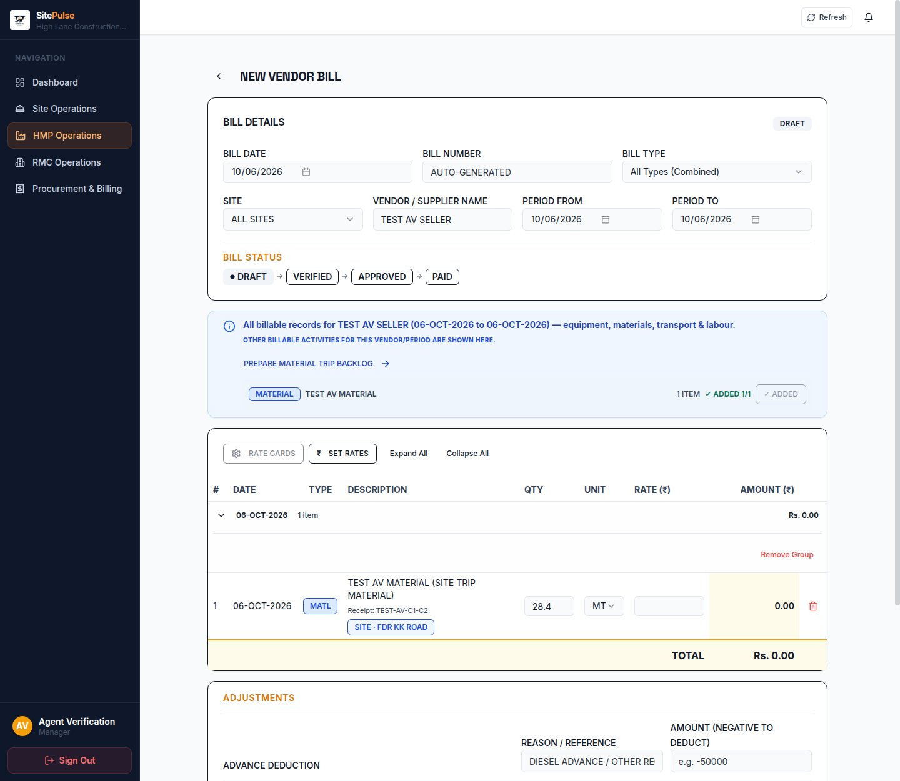
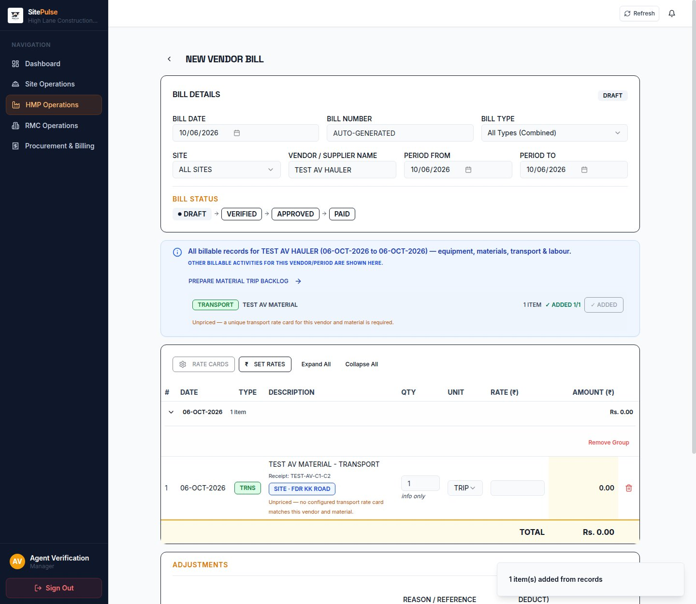
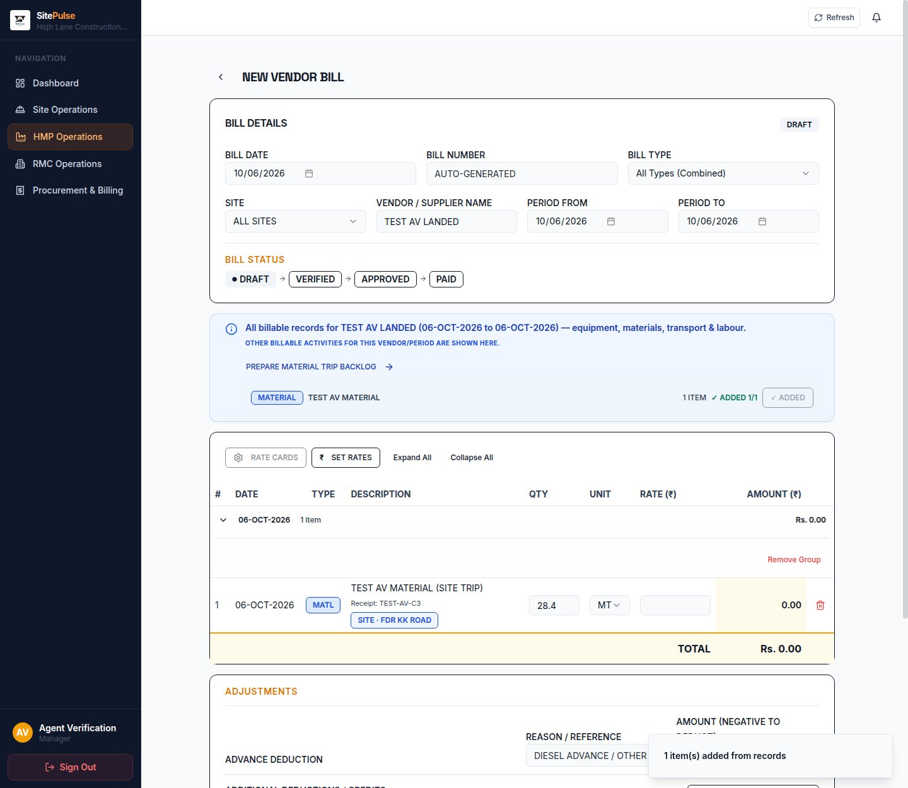
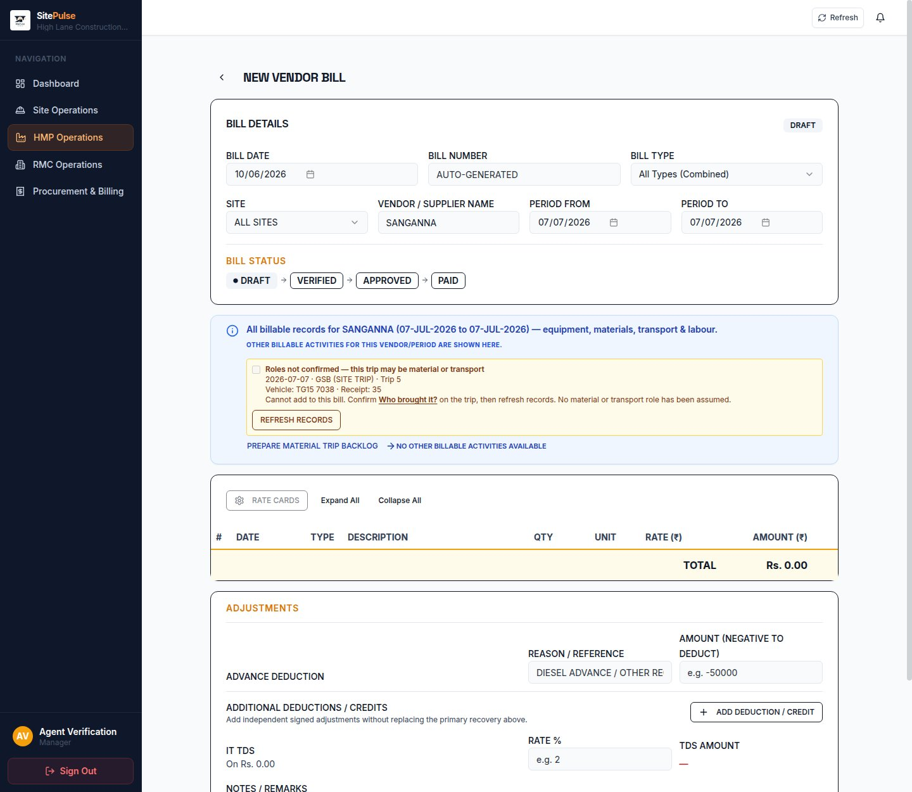
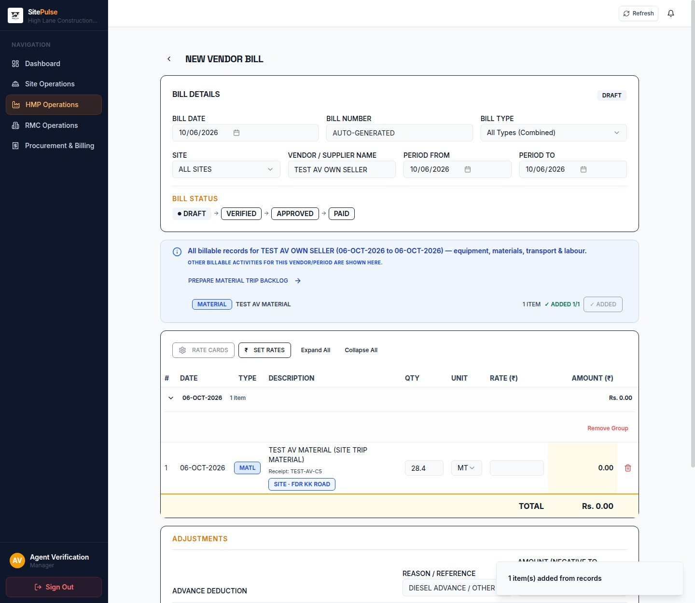

# Development verification account and Part C browser acceptance

## Current grants — DEV-ACCT-02 (2026-10-08)

Development only: `sitelog_dev`, ordinary verification account ID 16.
`isAdmin`, `isOwner`, `isFieldEngineer`, `canManagePermissions` remain **false**.
No real person's rows or credentials may be changed.

| Section | Actions | Screen / guarded function |
|---|---|---|
| `site_materials` | view, create, edit | Material Trips; bulk arrangement linking; Set roles |
| `work_programme` | view, edit | Execution Arrangements register and rate saves |
| `work_programme_review` | view, edit | Arrangement review/evidence and planning review |
| `planning_masters` | view | Planning reference data |
| `vendor_bills` | view, create, edit | Vendor Bills, including legacy single-section guards |
| `vendor_bills_raise` | view, create, edit | Vendor bill creation/edit alternative guards |
| `vendor_bills_view` | view | Vendor Bills navigation gate |
| `master_parties` | view | Existing vendor choices required by Set roles and billing |

Existing unrelated view-only access is retained. **Delete, Export and Notify
must always be false on every section for this account.** A future test needing
those actions must use its own explicitly authorized temporary account and
remove it afterwards. No approval or permission-management rights were added.

Reproduce grants with `node scripts/dev-verification-grants.mjs`. The same
function is called by the existing account-maintenance/sign-in script
`scripts/permission03b1-signin.mjs`. It asserts the database name before any
write, validates the expected account identity and ordinary flags, and updates
only its permission rows in one transaction. It is idempotent; it is not an app
startup hook, seed hook, bypass or new feature flag. After a reset, restore the
existing test account first; the script refuses to create a duplicate or modify
an unexpected user occupying ID 16.

For ordinary login, use `DEV_VERIFICATION_PASSWORD` directly inside the login
process with `/api/auth/login`; never print or persist its value. Approve only
the specifically identified disposable development device if pending. The
maintenance script retains its existing password-restoration behavior, but
DEV-ACCT-02 verification did **not** reset any password. See
`scripts/dev-acct02-verify.mjs` for the normal-login/browser procedure and cleanup.

The older permission inventories below describe historical runs, not current
access. Current before/after rows are in `reports/dev-acct02/permissions.json`.

Latest sign-in verified 2026-10-07 (PERM-03B-1). Development database: `sitelog_dev`.

## Account

- Name: **Agent Verification**
- Identifier: **agent.verification@test.invalid**
- User ID: **16**
- `isAdmin`, `isOwner`, `isFieldEngineer`, `canManagePermissions`: **false**
- `setupComplete`: **true**
- `allSitesAccess`: **false**
- Session policy: **sticky**
- Generated password is **not in this repository or report**.

## Durable credential restoration — PERM-03B

The existing ordinary development account (ID 16) was retained. Its password
was reset from the **DEV_VERIFICATION_PASSWORD** Replit Secret; no account
flags or permissions were changed. The user supplied the secret through the
secure form because the available tool could not save an agent-generated
password. This is the disclosed deviation from agent-generated credentials.

Future runs:

1. Confirm the existing `DEV_VERIFICATION_PASSWORD` Replit Secret is present
   in development. If absent, stop; do not use a container-file fallback.
2. Start the normal application and a Chromium page with DevTools on port
   9232 (reuse a running verification browser if present). Otherwise run:
   `chromium --headless --no-sandbox --disable-dev-shm-usage --remote-debugging-address=127.0.0.1 --remote-debugging-port=9232 --user-data-dir=/tmp/verification-browser about:blank`
   as a background process. This disposable profile is not password storage.
3. Run `node scripts/permission03b1-signin.mjs`. It uses only the development
   connection, asserts `SELECT current_database()` is `sitelog_dev` before
   writing, reuses the existing account, checks all four admin-related flags
   are false, and resets its password from the secret without printing it.
4. The script uses ordinary `/api/auth/login`, approves only the pending
   device identified by that login's own signed cookie, then logs in again.
   It requests `/api/auth/me` and opens `/account` in the signed-in browser,
   waiting for the actual account details before taking the screenshot.
5. Read `reports/perm-03b1/signin-proof.json` and
   `reports/perm-03b1/signed-in-account.jpg`. Latest login, protected API and
   page document were all HTTP **200**, with the account page visibly rendered.

The script stops rather than creating a duplicate or changing flags if the
existing account is missing or privileged. It now restores only the explicitly
approved development verification grants documented above.
Device approval remains development-only under the explicit authorization.
The password survives container replacement in Replit Secrets; browser sessions
are disposable and are never the credential source.

### Historical container-only notes (superseded)

The old private task notes were outside the repository, under
`/home/runner/.local/state/agent-verification/`:

- `account.json`: generated account credentials; mode 0600.
- `session.json`: approved device/session cookies; mode 0600.

The containing directory is mode 0700. These are local task notes, not Replit
Secrets or portable workspace memory. They may be lost if the container is
replaced. Never print, attach, commit, or copy their contents into reports.

## HTTP and browser proof

| Request | Status | Meaning |
|---|---:|---|
| Initial `POST /api/auth/login` | 202 | Created this account's pending device |
| Same login after approving only device 94 | 200 | Ordinary login minted a session |
| Authenticated `GET /api/auth/me` | 200 | Protected authentication endpoint |
| Authenticated `GET /plant/vendor-bills` | 200 | Page document served |
| Authenticated candidate endpoint, each of five test vendors | 200 | Real permission-checked data reads |

The page's HTTP 200 alone is not treated as proof of authentication: a real
Chromium browser rendered the protected bill form as **Agent Verification**,
queried the real API, and performed the candidate pulls. The screenshots below
are from that signed-in browser, not mockups or the signed-out screenshot tool.
The account retained its ordinary flags throughout.

The proxied development hostname returned HTTP 404 during the first login
attempt. The running development service on port 5000 was then used directly.
No workflow was restarted and no host/app configuration changed.

## Exact rows created

### Authentication and access data

| Table | New IDs | Details |
|---|---|---|
| `users` | 16 | Agent Verification |
| `user_devices` | 94 | Created by normal login for user 16, then changed from pending to approved |
| `user_sessions` | 346 | Created by normal successful login; device 94 |
| `user_permissions` | 2075 | `vendor_bills_view`: View |
| `user_permissions` | 2076 | `vendor_bills_raise`: View + Create |
| `user_permissions` | 2077 | `site_materials`: View |
| `user_permissions` | 2078 | `finance_hub`: View |
| `user_permissions` | 2079 | `site_hub`: View |
| `user_site_access` | 14–21 | Eight explicit view-only site grants, mapping below |

All other action bits on these five new permission rows are false. There are
no approval, edit, delete, export, notification, permission-management, admin
or owner grants.

Site-grant mapping: `14→16`, `15→5`, `16→14`, `17→1`, `18→6`, `19→7`,
`20→18`, `21→19` (grant ID → site ID).

Device 94 alone was approved by a user-authorized development database update:
status approved, approval timestamp set, revocation fields null. Its
`approved_by_user_id` remains null: no human/admin actor was impersonated.
Browser/API requests subsequently update this new account's normal activity
timestamps.

### Four new test trips

All four are dated **2026-10-06**, site **FDR KK ROAD** (existing site ID 1),
material **TEST AV MATERIAL**, quantity **28.4 MT**, entered by **Agent
Verification**. Their notes explicitly identify synthetic acceptance fixtures,
not operational receipts.

| Trip ID | Case | Material source | Transporter | Transport type | Equipment | Receipt |
|---|---|---|---|---|---|---|
| 13 | C1 + C2 | TEST AV SELLER | TEST AV HAULER | agency_vendor | none | TEST-AV-C1-C2 |
| 14 | C3 | TEST AV LANDED | TEST AV LANDED | agency_vendor | none | TEST-AV-C3 |
| 15 | C4 | missing | TEST AV UNRESOLVED | missing | none | TEST-AV-C4 |
| 16 | C5 | TEST AV OWN SELLER | none | in_house | existing owned equipment ID 1 | TEST-AV-C5 |

No vendor-master or material-master rows were created. Test labels are only
on the newly inserted trips. No existing trip was altered. Per-row content
checksums of all **six pre-existing trips** matched before and after the
browser run. There are now **ten trips** in development.

No bill was saved. Candidate pulls changed only the unsaved form; the form was
discarded between cases. No rate cards were created or changed.

## C1–C5 signed-in results

All cases used **All Types (Combined)** so a wrongly offered second category
would remain visible. New fixtures used **2026-10-06 to 2026-10-06**; the
historical C4 check used **2026-07-07 to 2026-07-07**.

### C1 — material-only vendor

**Passed.** TEST AV SELLER returned and pulled exactly one material row for
trip 13: `TEST AV MATERIAL (SITE TRIP MATERIAL)`, 28.4 MT. Zero transport rows.

### C2 — transport-only vendor

**Role split passed; configured-rate pricing not verified.** TEST AV HAULER
returned and pulled exactly one transport row for trip 13:
`TEST AV MATERIAL - TRANSPORT`, one TRIP, with the API retaining physical
quantity 28.4 MT. **Zero material rows**.

No matching card exists for this intentionally new test vendor/material.
The actual screen correctly shows an unpriced warning and ₹0, without a
material-rate fallback. Creating or changing rate cards was outside this
instruction. Therefore this does **not** prove the earlier Part C requirement
for a populated card's priced amount in the live browser.

### C3 — same party

**Passed for single-row behavior.** TEST AV LANDED returned and pulled exactly
one landed material row for trip 14, 28.4 MT, description
`TEST AV MATERIAL (SITE TRIP)`, original-style source
`site_material_trip:14`. No second material or transport row.

This new fixture has no historical saved bill to compare; the screenshot
proves the current one-row behavior, not an old deployment side-by-side.

### C4 — actual unresolved historical trip

**Passed against original saved data.** Vendor **SANGANNA**, period
**2026-07-07 to 2026-07-07**, returns original trip **5**, GSB, receipt 35.
The actual offer is amber and reads:
“Roles not confirmed — this trip may be material or transport”.
Its checkbox is **unchecked and disabled**. The browser DOM confirmed
`checked=false`, `disabled=true`. There is no Pull button for it, the bill
remains empty, and the Who brought it? correction link is visible.

The same behavior was also tested with new synthetic trip 15. That supplemental
fixture and screenshot `dev-verification-screenshots/C4-unresolved.jpg` remain
available; they are not substituted for the original historical evidence above.

### C5 — in-house trip

**Passed for the fixture.** TEST AV OWN SELLER returned and pulled one material
row for trip 16, 28.4 MT; zero transport rows. The saved fixture has no
transporter and references real existing owned equipment ID 1.
That equipment has no vendor name to test as a separate equipment-vendor pull.

## How a future verification run signs in

1. Use only the existing development service and `DEV_DATABASE_URL`. Assert
   `SELECT current_database()` returns `sitelog_dev` before any database write.
   Do not inspect or access any production connection variable.
2. Read the private `account.json` programmatically. Never echo its password.
   Use the ordinary login form or `POST /api/auth/login` with `identifier` and
   `password`. Preserve the account's device cookie and response session
   cookies. Reusing the approved device avoids creating another pending row.
3. Use those genuine cookies in the browser/API client, not a fabricated
   session or an authentication bypass. The reusable private session notes
   correspond to device **94**. If the session expired, log in normally again.
4. If login returns 202, inspect **only user 16's device rows**. Identify the
   exact device created/used by this attempt; do not approve all pending rows.
   If its identity is ambiguous, stop.
5. For the exact selected device, update the development row using both
   `id = :selectedDeviceId` and `user_id = 16`, with `status = 'pending'`
   as an additional guard. Set status approved and `approved_at = now()`,
   clear revoked fields, and require exactly one updated row. Do not assign
   a real person's approving actor ID. Do not approve a revoked device
   automatically.
6. Retry normal login with the same device cookie. Require login 200,
   `/api/auth/me` 200, and the expected user ID/name before testing.
7. If the private credential notes are missing, stop and report that loss;
   do not read/reset any real person's credentials or silently create a
   duplicate verification account.

The provided testing-agent configuration was unavailable in this environment,
so verification used installed Chromium through its DevTools protocol.
Temporary browser tooling lives outside the repository under
`/tmp/agent-verification-private/`. No test-mode code was added.

## Boundaries

**Production was not touched, and no application code, schema, migration,
feature flag or workflow configuration changed.**

No existing person's credentials were read, reused or reset. No existing
person's flags or permissions were changed. No publishing or follow-up tasks.
